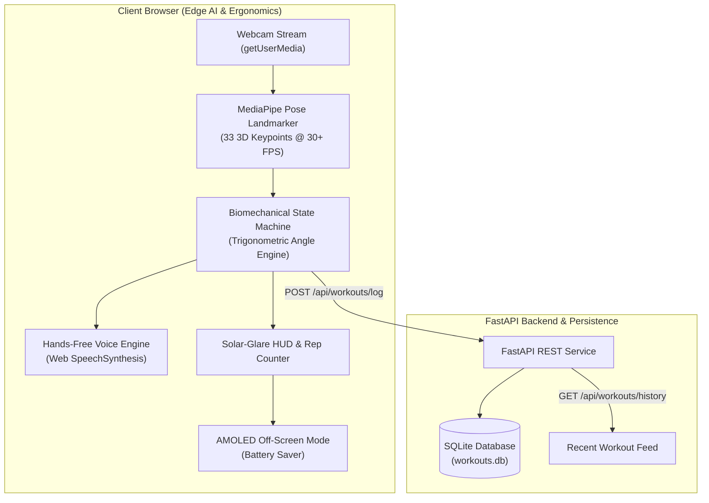

# Touch Grass — Outdoor Fitness Coach

> An edge-powered, hands-free calisthenics & playground fitness assistant with real-time MediaPipe pose biomechanics, offline voice coaching, solar-glare outdoor UI, and AMOLED battery saver mode.

**Team Name:** Team QT

---

### The Problem
Calisthenics and outdoor playground fitness have grown rapidly, but athletes face a common barrier: existing fitness apps require users to hold or constantly look at their phone screens to check form and track reps. In direct outdoor sunlight, intense glare washes out screens, touchscreens become unresponsive from sweat or chalk, and continuous camera-driven screen rendering rapidly drains mobile battery.

### Why We Chose This Problem
Our team wanted to build an application that encourages people to go outside ("touch grass") and train calisthenics freely. Outdoor calisthenics requires full mental focus, spatial awareness, and proper biomechanics (e.g., squat depth, straight back during planks, chin over bar on pull-ups). By taking an edge-first AI approach, athletes can prop their phone on a park bench and train completely hands-free and eyes-free.

---

### Proposed Solution & Key Features
**Touch Grass** transforms any camera-enabled browser into an intelligent, autonomous outdoor calisthenics coach:

- **Edge Computer Vision Biomechanics**: Real-time 33-point 3D pose landmark detection running locally in the browser via MediaPipe. Tracks joint flexion/extension angles for squats, push-ups, pull-ups, and jumping jacks without transmitting video to the cloud.
- **Hands-Free Zero-Latency Voice Coaching**: Uses the browser's native `SpeechSynthesis` API to announce real-time rep counts ("One!", "Two!"), movement inflections ("Drive up!"), and form checks ("Form check: squat lower!").
- **Solar-Glare Resistant UI**: High-contrast matte dark interface (`#070B14`) with high-visibility neon lime (`#A3E635`) and cyan accents, paired with oversized 80pt+ typography legible from 3–5 meters away in bright sunlight.
- **AMOLED "Off-Screen" Battery Saver**: Fullscreen blackout overlay that dims the display to 0% brightness while keeping camera pose processing and voice coaching active in the background, conserving battery during outdoor sessions. Tap anywhere to wake.
- **Local Persistence & Metric Logging**: FastAPI REST API backed by an embedded SQLite database (`workouts.db`) tracking completed repetitions, elapsed time, and estimated calories burned.

---

### Architecture



---

### Technology Stack

| Category | Technologies |
| :--- | :--- |
| **Frontend** | HTML5, Modern Vanilla JavaScript (ES6+), Tailwind CSS (CDN), HTML5 Canvas API |
| **Backend** | Python 3.10+, FastAPI, Uvicorn, Pydantic, Starlette |
| **Database** | SQLite (`workouts.db`), Python `sqlite3` |
| **AI / ML** | MediaPipe Pose Landmarker (33 3D body keypoints), Biomechanical Trigonometry State Machines |
| **Infrastructure** | Edge / Client-side Execution, Playwright Headless Chromium, Pytest |
| **APIs / Services** | Web Speech API (`SpeechSynthesis`), MediaDevices Web API (`getUserMedia`), Touch Grass REST API (`/api/workouts/log`, `/api/workouts/history`) |

---

### How It Works
1. **Video Capture & Joint Normalization**: The camera stream is mirrored and ingested frame-by-frame.
2. **Biomechanical Angle Computation**:
   $$\theta = \arccos\left(\frac{\vec{BA} \cdot \vec{BC}}{|\vec{BA}| |\vec{BC}|}\right) \times \frac{180}{\pi}$$
   - **Squats**: Calculates knee angle (Hip $\rightarrow$ Knee $\rightarrow$ Ankle). Rep inflection $<95^\circ$, lockout $>160^\circ$.
   - **Push-ups**: Calculates elbow angle (Shoulder $\rightarrow$ Elbow $\rightarrow$ Wrist). Down inflection $<90^\circ$, lockout $>155^\circ$. Validates spine line (Shoulder $\rightarrow$ Hip $\rightarrow$ Ankle $>145^\circ$).
   - **Pull-ups**: Calculates elbow flexion from dead hang ($>150^\circ$) to chin clearing bar ($<75^\circ$).
   - **Jumping Jacks**: Computes relative stance width and overhead arm abduction deltas.
3. **Dual-Threshold Hysteresis**: Debounces state transitions to prevent false positives and jitter.
4. **Voice Queue**: Prioritizes urgent form cues and rep counts over background speech.

---

### Technical Decisions
- **Client-Side Edge AI vs Server-Side Streaming**: Running MediaPipe directly in WebAssembly/WebGL eliminates network bandwidth consumption, privacy concerns (no raw video leaves the device), and latency in outdoor cellular environments.
- **Native Web Speech API vs Cloud TTS**: Using browser-native speech synthesis guarantees offline zero-latency audio playback without paying for cloud API calls or suffering cellular audio lag.
- **AMOLED Off-Screen Mode**: In sunlight, mobile displays running continuous camera previews overheat and drain batteries rapidly. Dimming the DOM canvas while keeping background audio/pose tracking active saves mobile power.

---

### Work Completed During the Hack Day
- [x] Full-stack application architecture and FastAPI server setup.
- [x] SQLite database schema and REST API endpoints (`/log`, `/history`, `/health`).
- [x] MediaPipe Pose integration with real-time skeletal canvas rendering.
- [x] Trigonometric angle state machines for 4 calisthenics exercises.
- [x] Hands-Free Web Speech audio coaching engine with priority queuing.
- [x] High-contrast outdoor solar-glare UI and AMOLED off-screen battery saver.
- [x] Automated test suite: 6 backend unit tests + Playwright browser E2E test with mock camera streaming.

---

### Team Contributions (Team QT)
- **Monisa Reddy**: Lead Full-Stack & Edge AI Engineer — Designed the FastAPI backend, SQLite persistence, MediaPipe Pose biomechanics pipeline, Web Speech audio coach, and Playwright verification suite.
- **Sandeep Kumar S**: Product Planning, System Architecture & Repository Management.
- **Neil Ganguly**: UI/UX Design, High-Contrast Outdoor Color Palette & Biomechanical Standard Research.
- **Dinesh Karthik**: Testing & Edge Device Validation.

---

## Working Application
- **Local Application URL:** https://regulator-hacksaw-autism.ngrok-free.dev/
- **Testing:** Verified end-to-end with automated Chromium browser test with mock camera device streaming.

---

## Demo Video
- **Demo Video:** https://www.youtube.com/watch?v=Uyxmk9NL_sI

---

### AI / Models
- **MediaPipe Pose (Google):** Pretrained edge computer vision landmark detection model extracting 33 3D body keypoints in real time.
- **Gemini:** System architecture design, syntax verification, and trigonometric state machine design.
- **Antigravity:** Principal AI pair programmer for full-stack engineering, test automation, and deployment.

### Open Source Components
- **MediaPipe Pose (`@mediapipe/pose`)**: Apache 2.0
- **FastAPI**: MIT License
- **Uvicorn**: BSD 3-Clause
- **Tailwind CSS**: MIT License
- **Playwright**: Apache 2.0
- **Pytest**: MIT License

---

## Setup and Usage

### Prerequisites
- Python 3.10+
- Modern Web Browser with camera & audio permissions

### Installation
```bash
git clone https://github.com/iamsandeepsrk/hacktoberfest-team-qt.git
cd hacktoberfest-team-qt
pip install -r requirements.txt
playwright install chromium
```

### Running the Application
```bash
uvicorn app.main:app --host 127.0.0.1 --port 8000 --reload
```
Open [http://127.0.0.1:8000](http://127.0.0.1:8000).

### Running Tests
```bash
pytest -v
```

---

## Devpost Submission
- **Devpost Project:** https://devpost.com/software/touch-grass-outdoor-fitness-coach

---

## Credits and License
Distributed under the **MIT License**.
